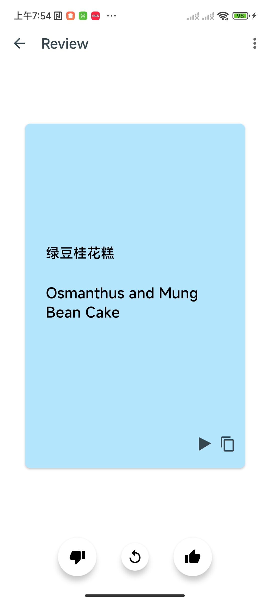
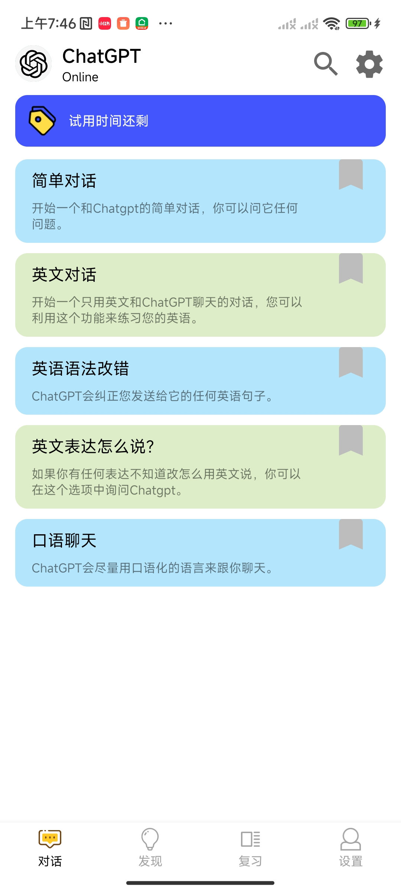
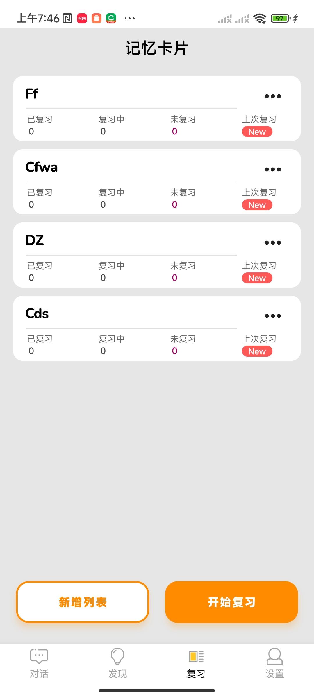
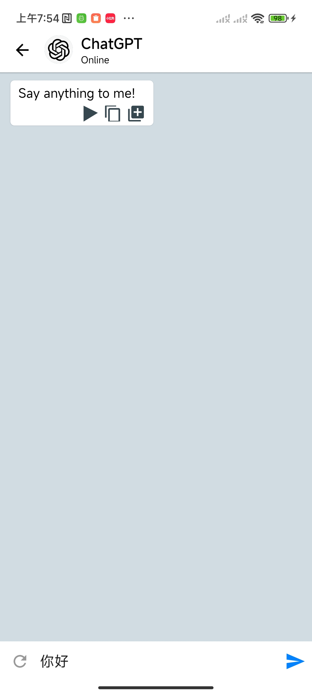

| 卡片页     |  | 支持语音播放，复制，记忆程度跟踪                |
| ---------- | ------------------------------------------------------------ | ----------------------------------------------- |
| 首页       |  | 支持多种预设gpt对话模式                         |
| 卡片生成页 |  | 输入主题，即可生成对应的测试卡片                |
| 订阅页     |  | 订阅页面                                        |
| 卡片集合页 |  | 测试卡片合集，可删除集合、增加卡片等            |
| GPT对话页  |  | 和gpt对话页面，可以播放语音、复制、转成测试卡片 |

